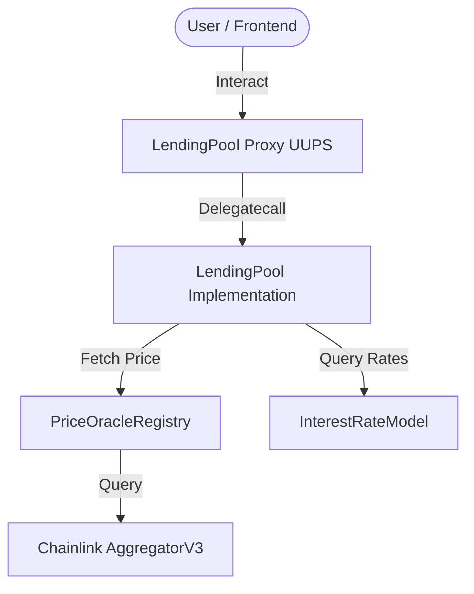

# DeFi Lending Protocol Architecture

This document details the design, mathematical models, and implementation details of the DeFi Lending Protocol.

## 1. System Overview

The protocol is designed as a hub-and-spoke system with a central, upgradeable `LendingPool` that coordinates core actions (depositing, withdrawing, borrowing, repaying, and liquidating). Peripheral components provide pricing and interest rate calculations.

## 2. Core Components

### PriceOracleRegistry
The single source of truth for asset valuation.
- **Decimal Normalization**: Re-scales prices from feed decimals (typically 8 for USD pairs) to a unified **18 decimals** (WAD).
- **Hardened Validation**: Every call checks that the price is positive, that the round is finalized (`answeredInRound >= roundId`), that the update time is non-zero and not in the future, and that the feed has updated within its configured `heartbeat` threshold.

### InterestRateModel
A piecewise-linear kinked rate curve inspired by Compound.
- **Utilization Rate ($U$)**:
  $$U = \frac{\text{Total Borrows}}{\text{Total Liquidity} + \text{Total Borrows} - \text{Total Reserves}}$$
- **Piecewise Borrow Rate**:
  - If $U \le Kink$:
    $$\text{Borrow Rate} = \text{BaseRate} + \left(U \times \text{Multiplier}\right)$$
  - If $U > Kink$:
    $$\text{Borrow Rate} = \text{BaseRate} + \left(Kink \times \text{Multiplier}\right) + \left((U - Kink) \times \text{JumpMultiplier}\right)$$
- **Supply Rate**:
  $$\text{Supply Rate} = \text{Borrow Rate} \times U \times \left(1 - \text{Reserve Factor}\right)$$

### LendingPool (UUPS Proxy)
Holds all pool liquidity and user balances.
- **Reentrancy Protection**: Uses OpenZeppelin's `ReentrancyGuard` (`nonReentrant` modifier) for all state-mutating external calls.
- **Checks-Effects-Interactions**: Followed strictly to prevent any possibility of reentrancy attacks.
- **Cumulative Interest Indexing**: Tracks cumulative borrow index for each asset so interest accrues block-by-block and compounds dynamically.

## 3. Key Mechanisms

### Health Factor ($HF$)
A user's borrowing capacity and safety margin:
$$HF = \frac{\sum \left(\text{Collateral Value in USD} \times \text{Liquidation Threshold}\right)}{\sum \text{Debt Value in USD}}$$
- If $HF < 1.0$, the user's position becomes eligible for liquidation.
- Discrepancies between ERC20 token decimals (e.g. 6 for USDC, 18 for WETH) are normalized to 18 decimals.

### Liquidation Engine
To protect the protocol from bad debt, third parties can cover a borrower's debt in exchange for their collateral at a discount:
$$\text{Collateral to Seize} = \frac{\text{Debt to Cover} \times \text{Price}_{\text{Debt}}}{\text{Price}_{\text{Collateral}}} \times (1 + \text{Liquidation Bonus})$$
- The liquidator transfers the debt asset directly into the pool.
- The corresponding collateral is transferred from the borrower to the liquidator.

### Upgradeability
The LendingPool uses the UUPS upgrade pattern, keeping proxy contract logic separate from state storage. Only the `owner` can authorize upgrades.
